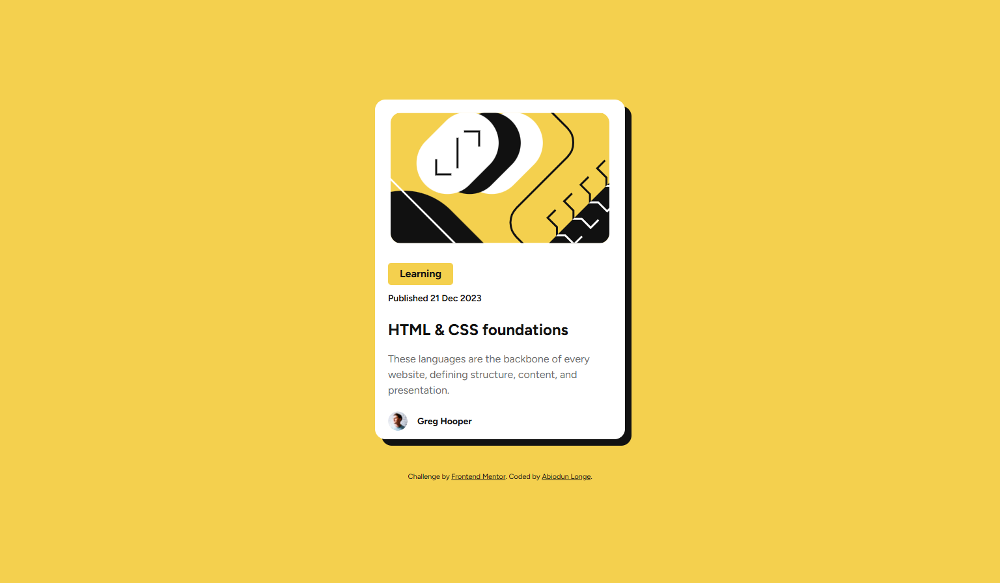
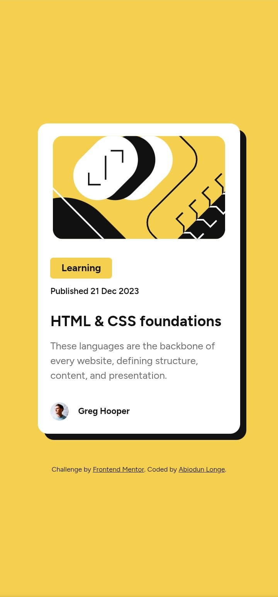

# Round 1 Log

This is for the first 100 days of code. Start: Mon Sep. 8, 2025.

---

### R1D1 - Sep. 8, 2025
Block and inline elements. By default, block elements will appear on the page stacked atop each other, each new element starting on a new line. An example is the h1 - h6 tags and the paragraph tag, p.

Inline elements do not start on a new line. They appear in line with whatever elements they are placed beside. Examples being the anchor tag, a, and span, which is used to group text to be applied styles.

The middle ground is the *inline-block*, which formats an element to be inline but take the characteristics of a block level element.

More in the [resources](./resources.md) tab.

Completed an assignment, hosted [here](https://github.com/odunlemi/css-exercises/tree/main/foundations/block-and-inline), and rebuilt an earlier recipes website with new css skills - https://odunlemi.github.io/odin-recipes/

## R1D2 - Sep. 9, 2025
Flexbox provides a way to arrange items into rows or columns. These items will flex, grow, or shrink based on defined rules.

Flexbox is just not a single css property, it's a toolbox of properties to arrange things where you need them. Elements can either become a flex container or a flex item. An element becomes a flex container with its display set to flex like so `display: flex`, and a an element is a flex item when it is nested in a flex container. 

More in the [resources](./resources.md) tab.

Worked on: a flexbox example - https://codepen.io/odunlemi/pen/dPYLJPg

## R1D3 - Sep. 10, 2025
Floats were the sole option of laying out a complex webpage. However, floats were originally designed for magazing-style layouts, and the kinds of layouts you can achieve with floats are somewhat limited. Flexbox was created to break out of the limitations. Flexbox gives complete control over the alignment, direction, order, size of the elements (boxes) in our layout.

More materials on the [resources](./resources.md) tab especially [interneting is hard](https://internetingishard.netlify.app/html-and-css/flexbox/).

Worked on: an example demonstrating all the flexbox properties - https://codepen.io/odunlemi/pen/azvrvvd

## R1D4 - Sep. 11, 2025
`flex: [value]`. The flex declaration is actually a shorthand for 3 properties that you can set on a flex item. These properties affect how flex items size themselves within their container. In this case, `flex` is actually a shorthand for `flex-grow`, `flex-shrink` and `flex-basis`.

With a value of 1, as commonly used, `flex: 1` equates to: `flex-grow: 1`, `flex-shrink: 1`, `flex-basis: 0`.

When `auto` is defined as a flex keyword it is equivalent to the values of `flex-grow: 1`, `flex-shrink: 1` and `flex-basis: auto` or to `flex: 1 1 auto` using the flex shorthand. Note that `flex: auto` is not the default value when using the flex shorthand despite the name being “auto”.

More in the [resources](./resources.md#css-layouts) tab.

Worked on: my r-log webpage, making it responsive using flexbox and setting it up for long term use - https://odunlemi.github.io/r-logs/

## R1D5 - Sep. 12, 2025
Axes in flexbox. When an element is made a flex container, its items align across two axes - the main axis and the cross axis. `justify-content` aligns items across the main axis. To change the placement of items along the cross axis use `align-items`. The main axis and cross axis are based on the `flex-direction` of the container, if `row` which is the default, the main axis goes from left to right (horizonatal) and the cross axis goes from top to bottom (vertical). 

Flex direction set to `column` switches those axes and `justify-content` then aligns items vertically and, `align-items`, horizontally.

More in the [resources](./resources.md#css-layouts) tab.

Working on*: an interactive guide to flexbox and course assignments - [Josh w. comeau's guide](https://www.joshwcomeau.com/css/interactive-guide-to-flexbox/) & [Foundation css exercises](https://github.com/odunlemi/css-exercises/tree/main/foundations/flex)

## R1D6 - Sep. 13, 2025
Flexbox is one of the many different layout algorithms, officially known as layout modes, in CSS. Each layout mode is its own sub-language within CSS. The default layout mode is the Flow layout but we can opt into flexbox by changing the display property on the parent container.

> When we flip `display` to `flex`, we create a **“flex formatting context”**. This means that, by default, all children will be positioned according to the Flexbox layout algorithm.

> Each layout algorithm is designed to solve a specific problem. The default **“Flow”** layout is meant to create digital documents; it's essentially the Microsoft Word layout algorithm. Headings and paragraphs stack vertically as blocks, while things like text, links, and images sit inconspicuously within these blocks.

> So, what problem does Flexbox solve? Flexbox is all about arranging a group of items in a row or column, and giving us a ridiculous amount of control over the distribution and alignment of those items. As the name suggests, Flexbox is all about flexibility. We can control whether items grow or shrink, how the extra space is distributed, and more.

This is the basic mental model for understanding flexbox, picked up in Josh W. Comeau's guide along with tons of examples.

More in the [resources](./resources.md#css-layouts) tab.

Worked on: a page layout [solution](https://codepen.io/odunlemi/pen/jEbjpqp) and my personal [website](https://odunlemi.github.io/)

## R1D7 - Sep. 15, 2025
Skipped yesterday (Sep. 14) but in keeping in line with the rules and [good practice](https://github.com/kallaway/100-days-of-code/blob/master/FAQ.md), I can miss a day but I'll make up for it with an added day at the end of the challenge. I absolutely cannot miss two days in a row though.

Learning the flexbox algorithm has been daunting, it *is* complex, but obviously a very powerful layout mode.

I could list out all I've learnt but that would be pretty redundant (because it spanned days). The most important takeaway is the mental model highlighted in R1D5, flexbox is an algorithm and the properties we define act as inputs to it on how it defines and implements them.

Some excellent resources to revisit for a quick primer:
- An interactive guide to flexbox by Josh W. Comeau*
- Flexbox Froggy
- Look at this CSS Tricks [cheatsheet](https://css-tricks.com/wp-content/uploads/2022/02/css-flexbox-poster.png) for a quick reminder on flex properties.

More in the [resources](./resources.md#css-layouts) tab.

Going forward, I'll be logging more accurately, this early in my journey I'm covering a lot of material, so it'll be the *key* thing learnt that day and **work done**.

Work done: 
- A landing project [exercise](https://odunlemi.github.io/odin-landing-page/)
- Rebuilt my personal website (https://odunlemi.github.io/) and redesigned it over the course of the missed day (Sep. 14)

## R1D8 - Sep. 16, 2025
Started on Frontend mentor challenges and coded the first one, which is a blog preview card. I had the chance to write a properly structured css file which I picked up on the tricks to from the previous tutorials and examples I've seen. Like declaring only base styles for the `body` tag, not using it as a flex container:

```css
body {
    font-family: 'Figtree', sans-serif;
    line-height: 1.5;
}
```
Using colour as `hsl` values:
```css
.content h1 a:hover {
    color: hsl(47, 88%, 63%);
    cursor: pointer;
}
```

I got to work with a design file on Figma and could reference it as guide coding. 

Also kicked off JavaScript. HTML and CSS add content and style, JavaScript adds interactivity. The simplest way to get started is to create an `html` file, add a basic structure and a `script` tag with a message in the body:

```html
<script>
        // JavaScript goes here

        // console.log() is the command to print 
        // something to the developer console 
        // in a browser

        console.log("Hello, JavaScript!")
    </script>
```

```js
Hello, JavaScript!
```

Opening up the webpage in a browser runs the javascript code and inspecting via dev tools shows the message displayed which means the code works.

Work done:
- Frontend Mentor Blog preview card [challenge](https://odunlemi.github.io/preview-card/)



## R1D9 - Sep. 17, 2025
A different way to include javascript in a webpage is through an external script, very similar to linking an external stylesheet:
```html
<script src="script.js"></script>
```
Variable and operators in javascript.
Variables are the building blocks of any program. Think of them as **"storage containers"** for data in your code.

There are 3 different ways to declare variables in javascript, one not so popular:
- `let` - a way to define a var and can be reassigned a different value later on in the code
- `const` - used to define static values and cannot be reassigned, an example is `pi = 3.14`
- `var` - the old way of defining vars, can still be found in codebases

Dealing with numbers in javascript. Numbers are the basics of programming logic, it's hard to realize any useful programming task without some numbers and basic math done.

Quick review on javascript [math](https://javascript.info/operators) | javascript.info

More in the [resources](./resources.md)

Also learned how to install node.js, a runtime environment that lets you run javascript outside a browser. 
Quick [guide](https://www.theodinproject.com/lessons/foundations-installing-node-js).

Work done:
- Made my blog preview page mobile responsive. Fixed it with a media query at the right break point:
```css
@media screen and (max-width: 600px) { 
    /* mobile styles here.. */ }
```
